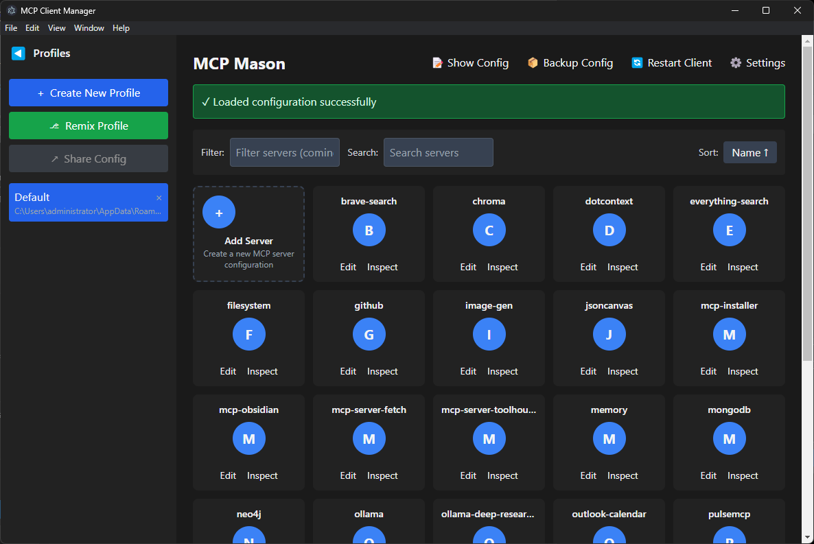
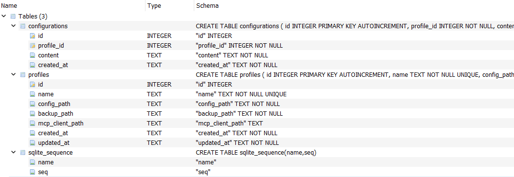

# MCP Configuration Manager

A powerful desktop application for managing Model Context Protocol (MCP) server configurations with an intuitive user interface.



## What is MCP?

The Model Context Protocol (MCP) enables communication between AI systems and locally running servers that provide additional tools and resources to extend AI capabilities. This configuration manager helps you create, edit, and manage MCP server configurations for Claude and other MCP-compatible AI applications.

## Features

- **Visual Configuration Editor**: Create and manage MCP server configurations with an intuitive UI
- **Profile Management**: Create, switch between, and remix different configuration profiles
- **Automatic Backups**: Keep historical versions of your configurations
- **MCP Inspector Integration**: Launch and interact with MCP server inspectors
- **Raw JSON Editor**: View and edit the raw configuration JSON
- **Client Integration**: Restart Claude or other MCP clients directly from the app
- **SQLite Database**: Persistent storage of profiles and configurations
- **Cross-Platform**: Works on Windows, macOS, and Linux

## Installation

### Prerequisites

- Node.js 16+ and npm

### Setup

1. Clone the repository:
```bash
git clone https://github.com/yourusername/mcp-configuration-manager.git
cd mcp-configuration-manager
```

2. Install dependencies:
```bash
npm install
```

## Development

### Start the development server:

```bash
npm start
```

### Run the Electron app in development mode:

```bash
npm run electron:dev
```

This will start both the React development server and the Electron application.

## Building

Build the application for production:

```bash
npm run build
```

This creates:
- Web assets in the `build` directory
- Compiled Electron main and preload scripts

For a distributable package:

```bash
npm run electron:build
```

## Project Structure

- `/src` - React application source files
  - `/components` - React components
  - `/types` - TypeScript type definitions
- `/electron` - Electron main process code
  - `/database` - SQLite database implementation
- `/public` - Static assets
- `/assets` - Application assets (icons, etc.)
- `/SCREENSHOTS` - Application screenshots

## Configuration Format

The application manages MCP server configurations in JSON format:

```json
{
  "mcpServers": {
    "server-name": {
      "command": "node",
      "args": ["path/to/server.js"],
      "env": {
        "API_KEY": "your-api-key"
      }
    }
  }
}
```

## Usage Guide

### Creating a New Profile

1. Click the profile sidebar toggle (▶) to expand it
2. Click "Create New Profile"
3. Enter a name for your profile
4. The new profile will be created with default paths

### Adding an MCP Server

1. Click the "Add Server" card in the main view
2. Enter the server details:
   - Name: A unique identifier for the server
   - Command: The executable to run (e.g., `node`, `python`)
   - Arguments: Command-line arguments (e.g., path to server script)
   - Environment Variables: Key-value pairs for configuration

### Editing Raw Configuration

1. Click "Show Config" in the top menu
2. Edit the JSON configuration directly
3. Click "Save" to apply changes

### Inspecting an MCP Server

1. Click "Inspect" on a server card
2. The inspector will launch in a new window
3. Use the inspector to debug and monitor the server

### Restarting the MCP Client

1. Click "Restart Client" in the top menu
2. Confirm the restart
3. The MCP client (e.g., Claude) will restart with the new configuration

## Database Structure

The application uses SQLite to store profiles and configurations:



## Troubleshooting

### Configuration Not Loading

- Ensure the configuration file exists at the specified path
- Check that the JSON format is valid
- Verify that the `mcpServers` object is present in the configuration

### MCP Server Not Starting

- Confirm the command and arguments are correct
- Check that any required environment variables are set
- Look for error messages in the application logs

### Client Not Restarting

- Ensure the client path is correctly set in the settings
- Check that the client is installed and accessible
- Try manually restarting the client if automatic restart fails

## Contributing

Contributions are welcome! Please feel free to submit a Pull Request.

## License

This project is licensed under the MIT License - see the LICENSE file for details.
